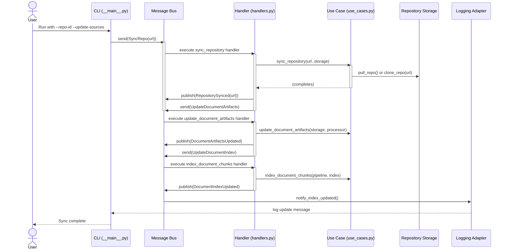

# Project Design

## Repository Structure

### Main package

The package is rooted at `src/docs_buddy`.

The structure underneath the package is as follows:

#### domain

Domain entities and domain services

#### service

Use case handlers, adapter interfaces, events and commands

#### adapter

Infrastructure level implementations

#### entrypoint

This is the presentation layer exposed to the external world.

### Tests

Tests are structured as follows:

#### unit

Tests for domain & service functionality and other isolated components

#### integration

Tests that span multiple layers of the architecture

#### e2e

End-to-end tests of functionality exposed at the entrypoints

## Sequence Diagram

